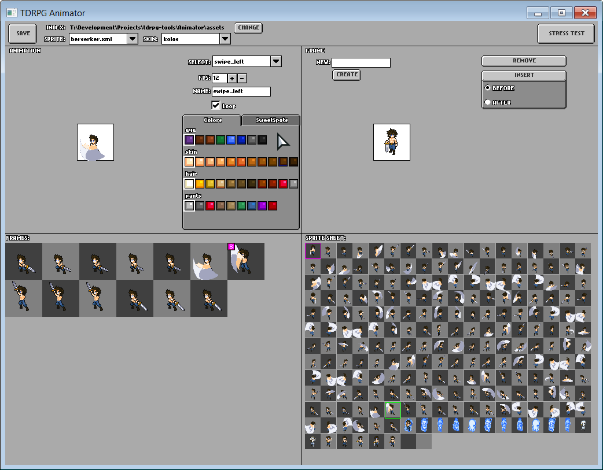
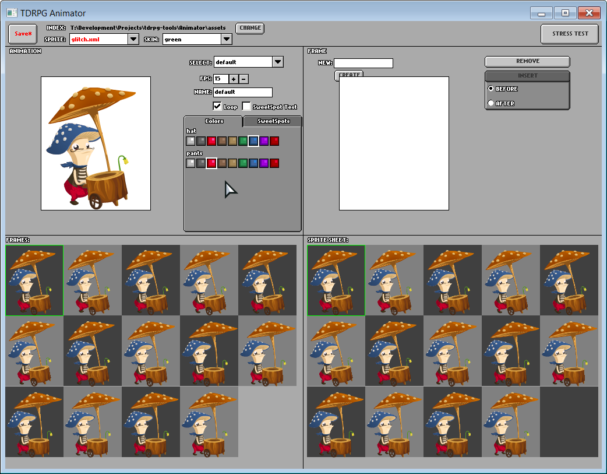
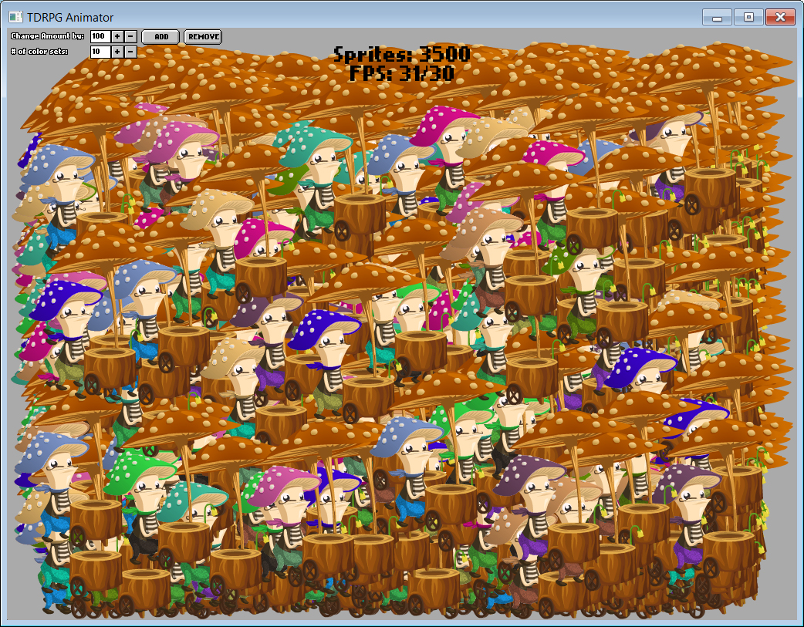
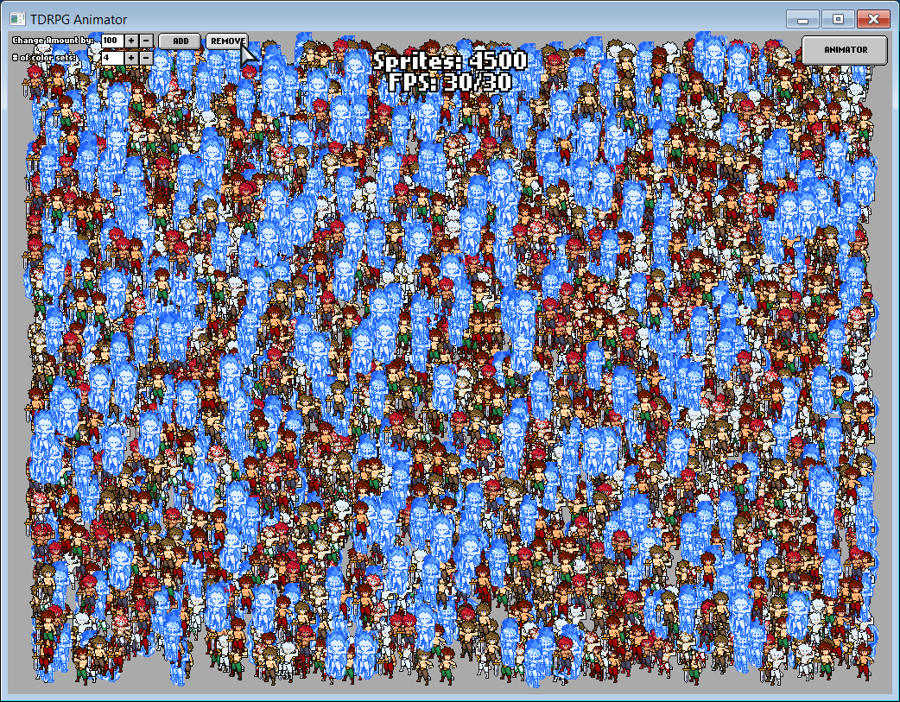

flixel-editors
===========

A set of editors for HaxeFlixel

#Animator
Animator is a tool for viewing, building, and colorizing animations and "skins" for HaxeFlixel-based "Entity" objects.
It's NOT for creating animations from scratch (like GraphicsGale), but for easily creating the necessary animation & colorization metadata visually.

Currently only works on C++ and Neko targets, because it has to write to file system.

Currently has some bugs.

